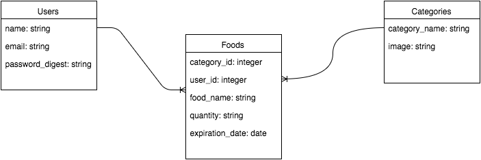

# Foodie-Pantry Management App#
### WDI Final Project ###

## Project Description ##
Foodie is a food management application that allows users to keep track of what's really inside their pantries and refrigerators.  The main goal of Foodie is to reduce food waste by keeping track of your pantry's contents for you.  Foodie also offers recipe suggestions for optimal food usage.   

## User Stories ##
* As a user, I want to create a new account.
* As a user, I want to login to my preexisting account to view my information and online pantry.
* As a user, I want to see a list of all my food items grouped by category.
* As a user, I want to add more food to my pantry.
* As a user, I want to edit any existing foods in my pantry.
* As a user, I want to delete any existing food items from my pantry.
* As a user, I want to indicate if I have used a portion of the food in my pantry.
* As a user, I want to see recipe suggestions containing the foods currently in my pantry.
* As a user, I want to be notified when a food item is about to reach it's expiration date.
* As a user, I want to receive an email two days prior to the expiration date of my food items.

## Technologies ##
* Ruby on Rails
* JavaScript
* AJAX
* HTML
* CSS
* PostgreSQL
* Active Record

## Database Design- ERDs ##

